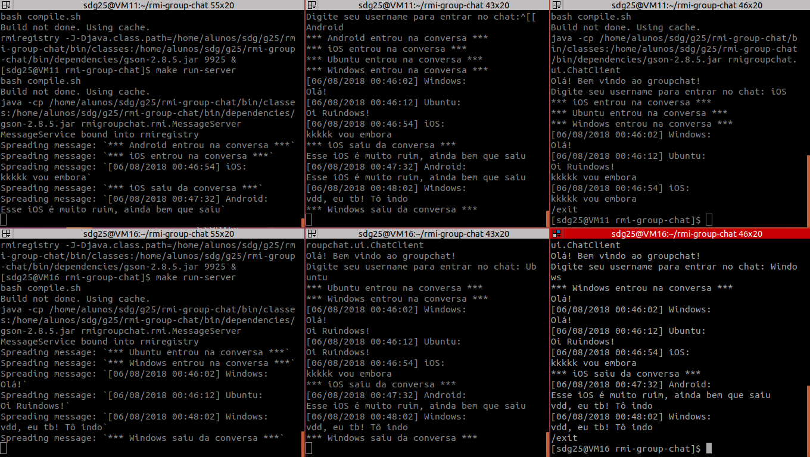
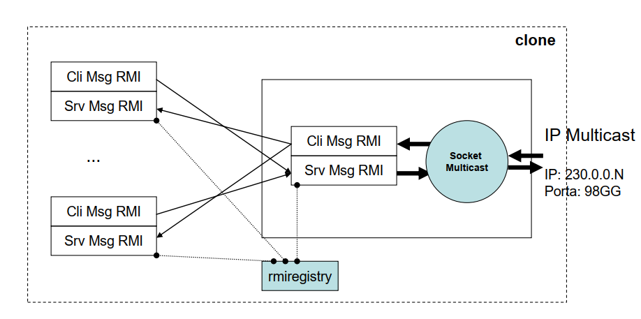

# RMI Group Chat

Este projeto implementa um sistema distribuído de chat de grupo com java RMI e sockets.



## Definição do sistema distribuído

O sistema é escalável em uma rede com suporte a multicast. Ele é composto por uma quantidade variada de nós, que pode ser ajustada de acordo com a demanda.

Cada nó do sistema distribuído tem:
* Um host rodando RMIREGISTRY
* Um host (pode ser o mesmo do RMIREGISTRY ou não) rodando o servidor da aplicação (servidor socket multicast, servidor RMI para enviar mensagens e cliente RMI para enviar mensagens recebidas do socket para os seus clientes)
* Vários hosts rodando cliente (sistema com UI interativa, que se comunica com o servidor)

Abaixo uma imagem represntando a arquitetura de um nó:



## Decisões do projeto

Todo endereçamento IP e portas da aplicação foram deixados em um arquivo de configuração (config.json) que é lido em runtime para flexibilidade da aplicação de rodar em diferentes hosts. Isso inclui o IP e porta do RMIREGISTRY e o IP e porta do servidor socket multicast.

Como terão múltiplos servidores RMI (servidor da aplicação e os clientes), foi adotado um padrão de nome de registro no RMIREGISTRY:
* Servidor da aplicação tem o nome MessageServer
* Cada cliente pede um _username_ ao usuário ao iniciar a aplicação e usa esse nome no seguinte padrão: MessageClient_\<_username_\>

Para o servidor socket multicast enviar uma mensagem recebida para todos os seus clientes, ele lista todos os registros do RMIREGISTRY e manda para todos excluindo o seu próprio (_MessageServer_).

Dessa forma, vale lembrar que apenas um, e exatamente um, servidor da aplicação deve estar rodando em um nó do sistema distribuído.

## Instruções para rodar

O projeto foi feito em Java 8 com Maven.

Para rodar o projeto, siga os seguintes passos:

### Sem maven (em ambiente linux com [make](https://linux.die.net/man/1/make))

1. Cheque se você tem uma pasta "bin/dependencies" com as dependências do projeto. Caso não, crie-a!

2. (Opcional) Rebuildar a partir do código-fonte:
```
$ make clean-build
```

3. Startar rmiregistry (A porta 9925 será usada. Está definida no arquivo config.json e Makefile):
```
$ make run-rmiregistry
```

4. Rodar servidor (arquivo config.json deve estar definido na pasta corrente):
```
$ make run-server
```

5. Rodar o cliente (em outro terminal):
```
$ make run-client
```

### Usando Maven

1. Buildar o projeto:
```
$ mvn clean install
```

2. Setar classpath para o JAR gerado pelo maven em target:
```
$ export CLASSPATH=target/rmi-group-chat-1.0-SNAPSHOT.jar
```

3. Startar rmiregistry (9925 é a porta que está no arquivo config.json):
```
$ rmiregistry 9925 &
```

4. Rodar servidor:
```
$ java rmigroupchat.rmi.MessageServer
```

5. Rodar o cliente (em outro terminal, lembrar de setar o classpath):
```
$ java rmigroupchat.rmi.MessageClient
```
